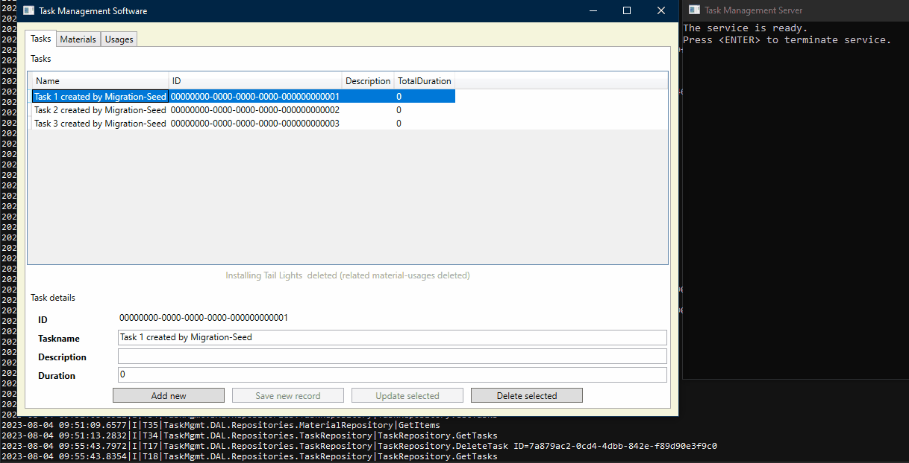

# TestProject WCF

Setup

- Visual Studio 2019
- .NET Framework 4.8

Dataflow

UI -> Proxy -> WcfService -> Repository -> Context -> DB

Version History

0.1.0

Known bugs

- UsageControl/TaskControl: Click on "Add new..." -> Delete button stays active (and if clicked: exception)
- WCF-timeout if UI not used for a while
- No data validation (for int)
- Error message When adding similar Usage (i.e. same Task-Material) - unspecified behaviour
- Exception when adding empty Task
- Exception when "Delete Usage Button" clicked after "New Usage Button" 
- If Material.Unit changed to a different base-unit - the related Usages.Units stay unchanged
